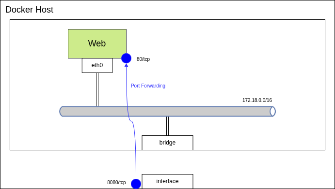
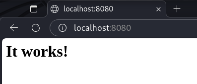
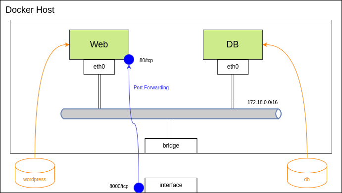
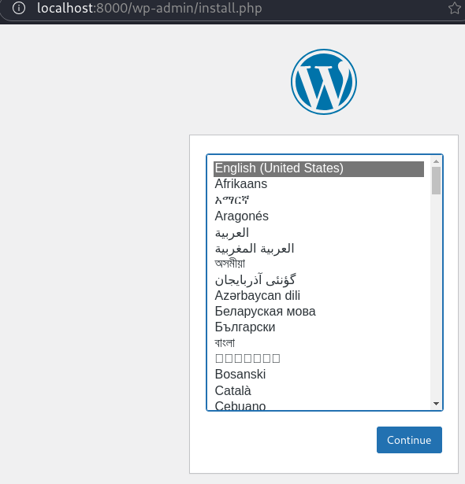
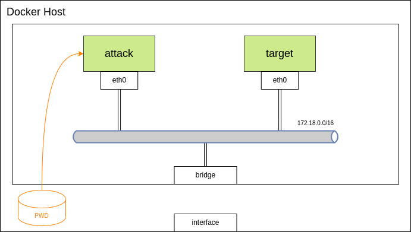
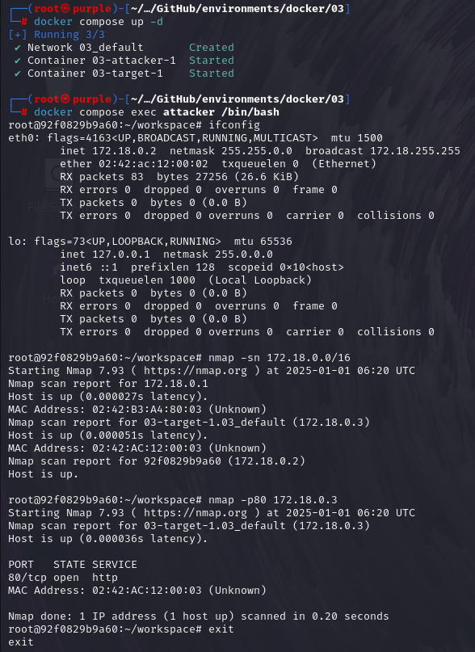

# README
Docker Compose を使った環境構築を行う。

- [README](#readme)
  - [参考](#参考)
  - [Docker Compose の概要](#docker-compose-の概要)
  - [例1: Web server の構築](#例1-web-server-の構築)
    - [例1-1 docker コマンド](#例1-1-docker-コマンド)
    - [例1-2 Docker Compose](#例1-2-docker-compose)
      - [コンテナ内でのコマンド実行](#コンテナ内でのコマンド実行)
      - [コンテナの停止](#コンテナの停止)
  - [例2: Web server と DB server から構成されるシステムの構築](#例2-web-server-と-db-server-から構成されるシステムの構築)
    - [ボリューム](#ボリューム)
      - [バインドマウントとの違い](#バインドマウントとの違い)
  - [例3: 攻撃マシンと被攻撃マシンの構築](#例3-攻撃マシンと被攻撃マシンの構築)


## 参考
- [dockerdocs](https://docs.docker.com/)
- [Docker ドキュメント日本語化プロジェクト](https://docs.docker.jp/index.html)
  - [ボリュームの使用](https://docs.docker.jp/storage/volumes.html)
  - [バインド マウントの使用](https://docs.docker.jp/storage/bind-mounts.html)
- [Docker&仮想サーバー完全入門　Webクリエイター＆エンジニアの作業がはかどる開発環境構築ガイド](https://book.impress.co.jp/books/1121101138)

## Docker Compose の概要
- 複数のコンテナを同時に扱うことができる
- yaml 形式のファイルで作成するコンテナを定義する

## 例1: Web server の構築
以下のようなシステムを docker コマンドと Docker Compose で構築する。



ただし、コンテナの構築には以下のイメージファイルを使う。

|Container|Image|Tag|
|---|---|---|
|Web|[httpd](https://hub.docker.com/_/httpd)|2.4.62|

### 例1-1 docker コマンド
```
# docker run -dit --name #{CONTAINERNAME} -p #{HOSTPORT}:#{CONTAINERPORT} httpd:#{TAG}
```

ただし、上記コマンド内のパラメータは以下のように設定する。

|Parameter|Value|
|---|---|
|`CONTAINERNAME`|my-apache-app|
|`HOSTPORT`|8080|
|`CONTAINERPORT`|8080|
|`TAG`|2.4.62|

起動後、状態を確認する。

```
# docker ps
CONTAINER ID   IMAGE          COMMAND              CREATED          STATUS          PORTS                                   NAMES
a139df3dd4a0   httpd:2.4.62   "httpd-foreground"   36 seconds ago   Up 34 seconds   0.0.0.0:8080->80/tcp, :::8080->80/tcp   my-apache-app
```

この状態で、ブラウザから `http://localhost:8080` にアクセスする。



終了後、コンテナを停止して削除する。

```
# docker stop #{CONTAINERNAME}
# docker rm #{CONTAINERNAME}
```

### 例1-2 Docker Compose
以下の YAML ファイルを作成する。なお、以下のファイルは [01/docker-compose.yml](01/docker-compose.yml) に保存している。

```yaml
services:
  web:
    image: httpd:2.4.62
    ports:
      - "8080:80"
```

```
# docker compose up -d [-f #{YAMLPATH}]
```

例1-1 と同様に、`http://localhost:8080` にアクセスすることが可能。

#### コンテナ内でのコマンド実行
以下コマンドでコンテナ内でコマンドを実行することが可能。

```
# docker compose exec #{CONTAINERNAME} #{COMMAND}
```

例えば、上記で作成した Web サーバに入るには以下コマンドを実行する。

```
# docker compose exec web /bin/bash
root@35fa8a327f3d:/usr/local/apache2# 
```

#### コンテナの停止
終了後は以下コマンドで停止する。

```
# docker compose down
```

## 例2: Web server と DB server から構成されるシステムの構築
以下のようなシステムを構築する。



|Container|Image|Tag|
|---|---|---|
|Web|[wordpress](https://hub.docker.com/_/wordpress)|6.7.1|
|DB|[mysql](https://hub.docker.com/_/mysql)|8.0.40|

[02/docker-compose.yml](02/docker-compose.yml) に設定ファイルを作成した。

```
# docker compose up -d
```

でコンテナを起動して `http://localhost:8000` にアクセスすると Wordpress にアクセスできる。



### ボリューム
コンテナ内のデータをコンテナ停止後も保持する方法として、ボリュームの活用が挙げられる。

ボリュームは docker コンテナによって作成される。例2 では Compose ファイル内でボリュームを作成するように指定した。

```
# docker volume ls
DRIVER    VOLUME NAME
local     02_db
local     02_wordpress
```

```
# docker volume inspect 02_db 02_wordpress
[
    {
        "CreatedAt": "2024-12-30T08:33:14+09:00",
        "Driver": "local",
        "Labels": {
            "com.docker.compose.config-hash": "96f0018fa609cc7a5bfd3f3813f6f0ff38c80119775ae635e5370f438ff633f8",
            "com.docker.compose.project": "02",
            "com.docker.compose.version": "2.32.1",
            "com.docker.compose.volume": "db"
        },
        "Mountpoint": "/var/lib/docker/volumes/02_db/_data",
        "Name": "02_db",
        "Options": null,
        "Scope": "local"
    },
    {
        "CreatedAt": "2024-12-30T08:33:14+09:00",
        "Driver": "local",
        "Labels": {
            "com.docker.compose.config-hash": "f9cb922ac0f0e2b18f7a40fd0a10f9ab3b8449389dbd2480678b8ed8ce0c6b56",
            "com.docker.compose.project": "02",
            "com.docker.compose.version": "2.32.1",
            "com.docker.compose.volume": "wordpress"
        },
        "Mountpoint": "/var/lib/docker/volumes/02_wordpress/_data",
        "Name": "02_wordpress",
        "Options": null,
        "Scope": "local"
    }
]
```

ボリュームのデータ自体は `/var/lib/docker/volumes` 以下に保存される。

#### バインドマウントとの違い
コンテナ内のデータをコンテナ停止後も保持するためのその他の方法は、Docker ホスト内のディレクトリもしくはファイルをコンテナにマウントする方法 (バインドマウント) である。

- ボリューム
  - Docker ホストのファイルやディレクトリをコンテナ内にマウント。ファイルやディレクトリは、Docker ホスト上の絶対パスとして参照
- バインドマウント
  - 新しいディレクトリがホストマシン上の Docker のストレージディレクトリ内に作成され、 Docker が内容を直接管理

Docker のドキュメントではボリュームの利用を推奨している。

## 例3: 攻撃マシンと被攻撃マシンの構築
以下のようなシステムを構築する。




|Container|Image|Tag|
|---|---|---|
|attack|[debian](https://hub.docker.com/_/debian)|stable-slim|
|target|[metasploitable2](https://hub.docker.com/r/tleemcjr/metasploitable2)|latest|

設定は [03](03/) 以下のファイル群に記載した。

```
# docker compose up -d
```

実験のときは、

```
# docker compose exec attacker /bin/bash
```

で攻撃端末に入れる。



---

[Top](../README.md)
